# Database Guardian: Issues and Enhancement Plan

## Overview

This document outlines key issues identified in the Database Guardian codebase along with detailed explanations and proposed solutions to enhance its functionality, reliability, and maintainability.

## Identified Issues and Solutions

### 1. Go Version Incompatibility

**Issue:** The `go.mod` file specifies version `1.23.4`, which doesn't exist yet (current latest is around 1.22).

**Impact:** This causes compatibility issues with standard Go installations and may lead to unexpected behaviors or build failures.

**Solution:** Update the Go version in `go.mod` to a stable, existing version like `1.21` or `1.22`.

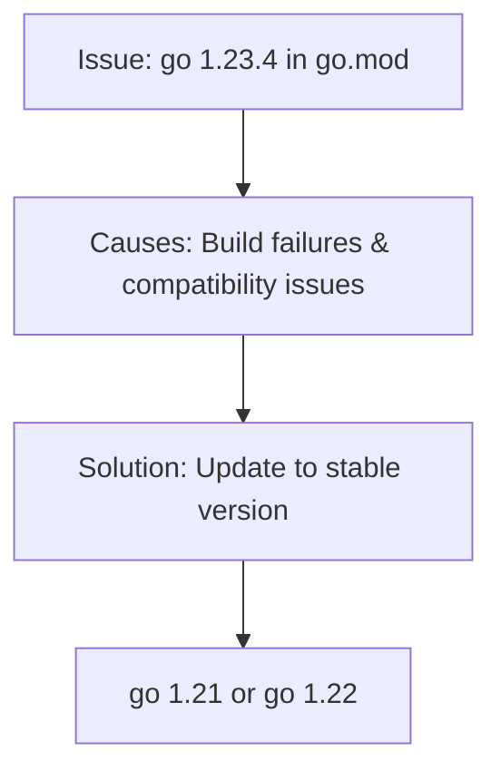

### 2. Logger Configuration Issues

**Issue:** The logger has colors enabled by default (`ForceColors: true, DisableColors: false`), causing ANSI color codes to appear as text in terminals that don't support them.

**Impact:** Log files contain ANSI escape codes (like `[36m`, `[0m`), making them harder to read in some environments.

**Solution:** 
- Make color settings configurable through environment variables
- Add a configuration option to disable colors
- Detect terminal capabilities

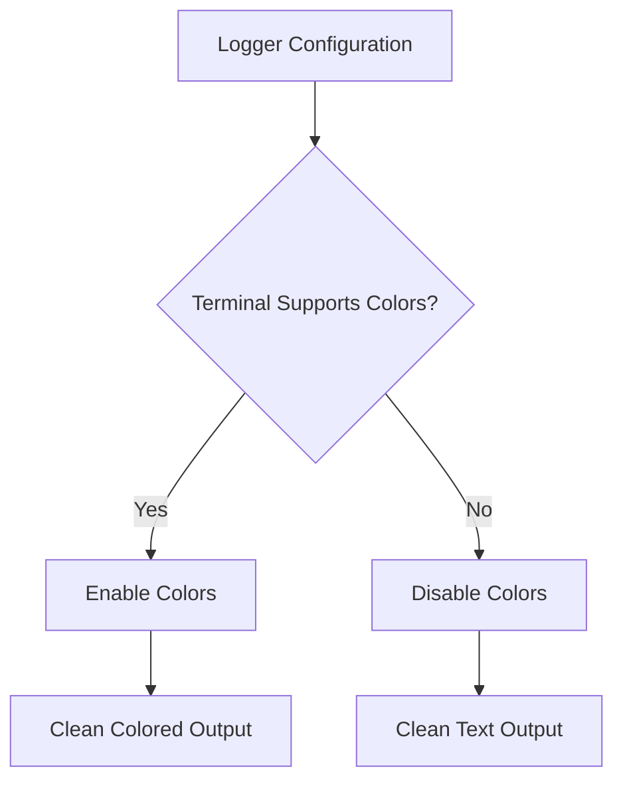

### 3. Error Handling Weaknesses

**Issue:** The codebase has several instances of inadequate error handling:
- In `backup.go`, errors from flag retrieval aren't checked (`host, _ := cmd.Flags().GetString("host")`)
- Some error-prone operations lack proper error handling

**Impact:** Runtime failures may occur silently, making debugging difficult.

**Solution:** Implement consistent error handling throughout the codebase:
- Check all errors returned from function calls
- Log detailed error information
- Create typed errors for different failure scenarios

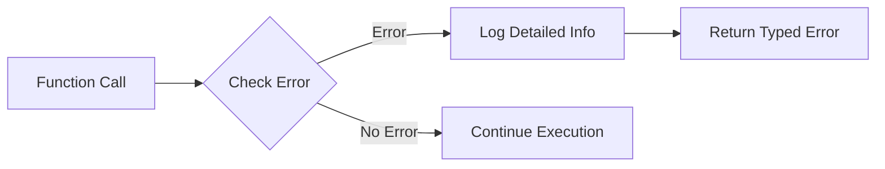

### 4. S3 Client Configuration

**Issue:** 
- `.env` file path is hardcoded as `"../.env"` in `NewS3Client`
- No retry mechanism for failed AWS operations

**Impact:** The application breaks if run from a different directory, and transient network issues can cause backup failures.

**Solution:**
- Use relative or configurable paths for `.env` file
- Add retry logic with exponential backoff for AWS operations
- Implement a more robust configuration management system

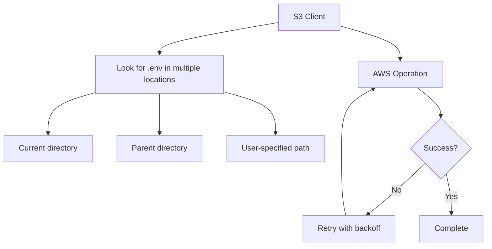

### 5. Backup Implementation Issues

**Issue:**
- Inconsistent code in `FullBackup()`: gzip writer is created but not used
- `backupFilePath` variable is used but not properly initialized

**Impact:** Backups may not be compressed correctly, and the S3 upload functionality may fail.

**Solution:**
- Fix the gzip implementation to properly compress the database dumps
- Ensure variables are correctly initialized and utilized
- Add tests to verify backup functionality

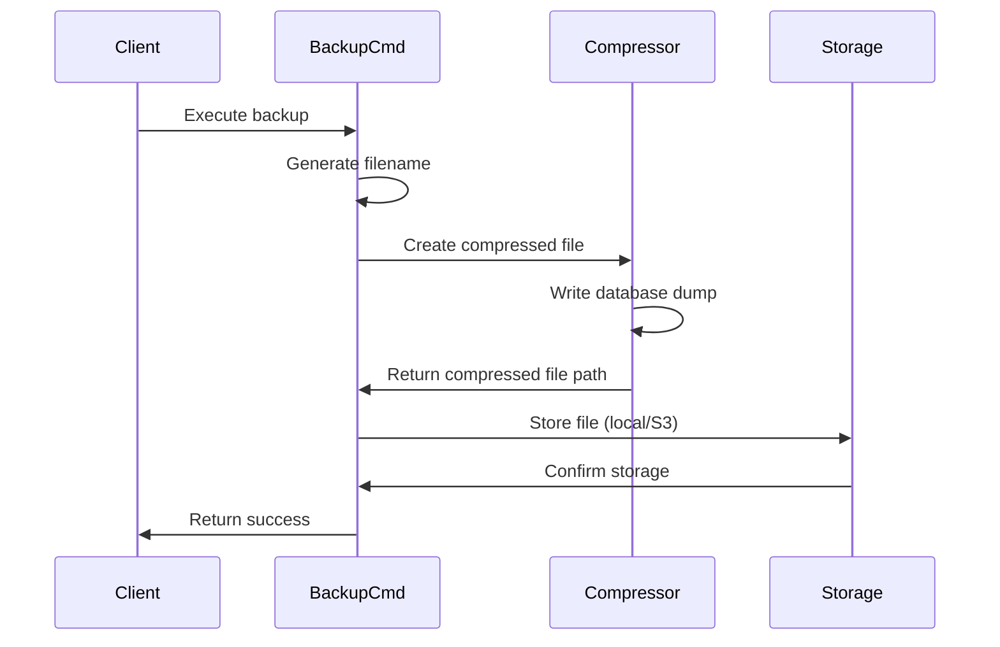

### 6. Limited Database Support

**Issue:** Despite claiming support for MySQL, MongoDB, and SQLite in documentation, only PostgreSQL is actually implemented.

**Impact:** Users expecting multi-database support will be disappointed.

**Solution:** 
- Implement the remaining database adapters
- Follow a consistent interface pattern for all database types
- Update documentation to clearly indicate support status

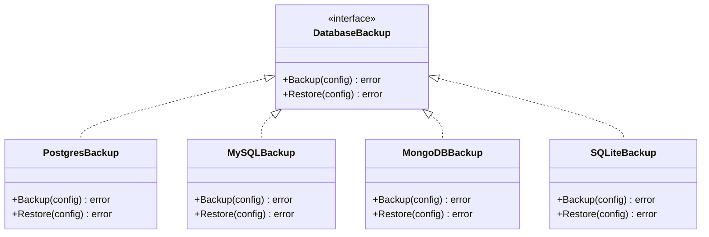

### 7. Command Structure Problems

**Issue:** 
- Switch statement in backup command has cases for database types, but only PostgreSQL is implemented
- Switch statement for storage has an empty "local" case block

**Impact:** The code structure suggests functionality that isn't implemented, leading to confusion and potential runtime errors.

**Solution:**
- Refactor command structure to use a strategy pattern
- Complete missing implementations or remove incomplete code
- Add appropriate error messages for unimplemented features

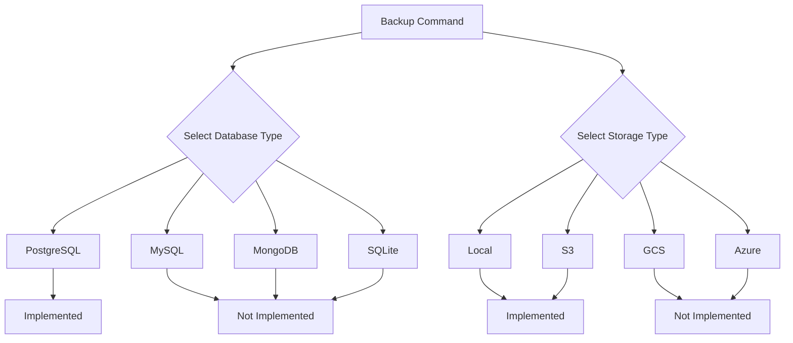

### 8. Security Concerns

**Issue:**
- Passwords passed as command line arguments (visible in process listings)
- No encryption for backed-up data at rest

**Impact:** Sensitive credentials may be exposed, and backup data is vulnerable if access controls are breached.

**Solution:**
- Use environment variables, credential files, or secure vaults for passwords
- Implement encryption for backed-up data
- Add secure password handling in interactive mode

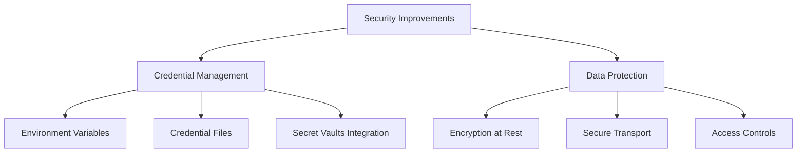

### 9. Missing Features

**Issue:** 
- Incremental and differential backups mentioned in README but not implemented
- Missing implementation for Azure and GCP storage options

**Impact:** The application doesn't meet all the features promised in the documentation.

**Solution:**
- Implement incremental backup support with proper change tracking
- Add support for additional cloud providers
- Update roadmap to clearly indicate feature status

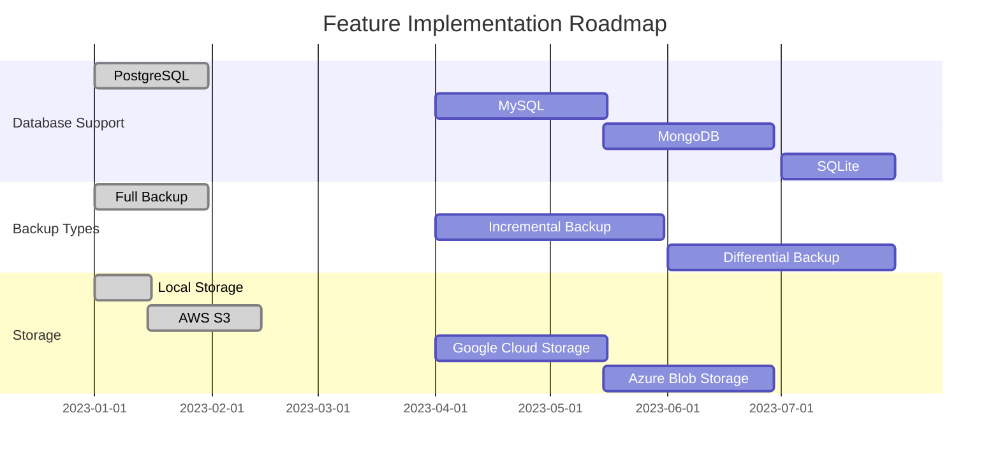

### 10. Configuration Management

**Issue:**
- Mixes environment variables and command-line flags inconsistently
- References to non-existing config.yaml file in README

**Impact:** Users have an inconsistent experience configuring the application.

**Solution:**
- Implement a consistent configuration hierarchy (defaults → config file → env vars → CLI flags)
- Add support for YAML/JSON configuration files
- Provide clear documentation on configuration precedence

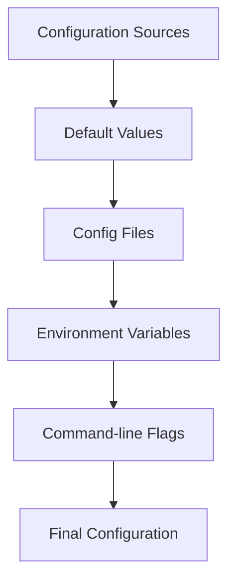

## Comprehensive Architecture Diagram

```mermaid
graph TD
    subgraph "User Interface"
        CLI[CLI Commands]
        Config[Configuration]
    end
    
    subgraph "Core Services"
        BackupService[Backup Service]
        RestoreService[Restore Service]
        SchedulerService[Scheduler Service]
    end
    
    subgraph "Database Adapters"
        PostgreSQL[PostgreSQL Adapter]
        MySQL[MySQL Adapter]
        MongoDB[MongoDB Adapter]
        SQLite[SQLite Adapter]
    end
    
    subgraph "Storage Adapters"
        LocalStorage[Local Storage]
        S3Storage[AWS S3]
        GCSStorage[Google Cloud Storage]
        AzureStorage[Azure Blob Storage]
    end
    
    subgraph "Support Services"
        Logger[Logger Service]
        ErrorHandler[Error Handler]
        Security[Security Service]
    end
    
    CLI --> BackupService
    CLI --> RestoreService
    CLI --> SchedulerService
    Config --> BackupService
    Config --> RestoreService
    Config --> SchedulerService
    
    BackupService --> PostgreSQL
    BackupService --> MySQL
    BackupService --> MongoDB
    BackupService --> SQLite
    
    RestoreService --> PostgreSQL
    RestoreService --> MySQL
    RestoreService --> MongoDB
    RestoreService --> SQLite
    
    BackupService --> LocalStorage
    BackupService --> S3Storage
    BackupService --> GCSStorage
    BackupService --> AzureStorage
    
    RestoreService --> LocalStorage
    RestoreService --> S3Storage
    RestoreService --> GCSStorage
    RestoreService --> AzureStorage
    
    BackupService --> Logger
    RestoreService --> Logger
    SchedulerService --> Logger
    
    BackupService --> ErrorHandler
    RestoreService --> ErrorHandler
    SchedulerService --> ErrorHandler
    
    BackupService --> Security
    RestoreService --> Security
```

## Implementation Strategy

To address these issues effectively, we recommend the following approach:

1. **Fix Critical Issues First:**
   - Go version compatibility
   - Logger configuration
   - Error handling improvements

2. **Enhance Core Functionality:**
   - Fix backup implementation issues
   - Improve S3 storage implementation
   - Add proper configuration management

3. **Implement Missing Features:**
   - Add support for additional databases
   - Implement incremental/differential backups
   - Add support for more cloud storage providers

4. **Enhance Security:**
   - Implement secure credential management
   - Add data encryption

5. **Improve User Experience:**
   - Better error messages
   - Interactive mode
   - Progress indicators

By addressing these issues methodically, Database Guardian can evolve into a more robust, secure, and feature-complete backup solution for database administrators.
